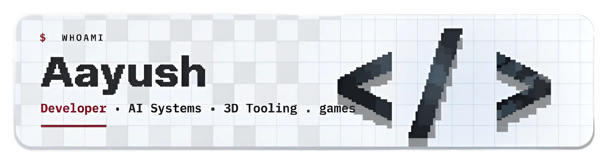

<!--
GitHub Profile README - itsAayush2004 (Aayush Kumar)
This file goes in a repo named exactly: itsAayush2004/itsAayush2004
-->

 

 

 

---

### 🚀 About me

Aayush Kumar — creative developer & game builder based in Jaipur, India. I build the ARTHIS universe: a feed of multiplayer mini-games (ARTHIS.space) and a handcrafted Unity "vertical city" experience (ARTHIS.land — The Wall), powered by a real-time relay I wrote from scratch in pure-stdlib Python. Off to the side, I build Travel Atlas — an interactive 3D globe in Three.js charting 30+ places I've explored and the ones I still dream of.

- 🎮 Building **multiplayer mini-games** and **interactive worlds** under the **ARTHIS** banner
- 🌆 Currently crafting **ARTHIS.land — "The Wall"**, a Unity vertical-city experience
- 🛰️ Wrote a **from-scratch TCP + WebSocket relay** (pure Python stdlib) for real-time multiplayer
- 🌍 Also building **Travel Atlas**, a Three.js 3D globe — live on GitHub Pages
- 🧩 I like the seam where **game design meets real-time systems and 3D on the web**
- 📫 Reach me at **akversebusiness@gmail.com**

---

### 📌 Featured Projects

<table>
<tr>
<td width="50%" valign="top">
<h3>🎮 ARTHIS.space</h3>

An endless, TikTok-style feed of single-player and multiplayer <b>mini-games</b> — swipe to the next one, no installs. The front door to the ARTHIS universe.

</td>
<td width="50%" valign="top">
<h3>🌆 ARTHIS.land — The Wall</h3>

A handcrafted <b>Unity</b> "vertical city" experience pulled from the Arthis archive — real-time multiplayer, playable in the browser via WebGL.

</td>
</tr>
<tr>
<td width="50%" valign="top">
<h3>🛰️ arthisland-relay</h3>

A <b>real-time multiplayer relay</b> for ARTHIS.land — 2–4 players per room, TCP <i>and</i> WebSocket, written from scratch with <b>zero dependencies</b> (Python stdlib only). Containerized & cloud-ready.

</td>
<td width="50%" valign="top">
<h3>🌍 Travel Atlas</h3>

A living, interactive <b>3D globe</b> in <b>Three.js</b> charting 30+ places I've been — and the ones I still dream of. Auto-deploys on GitHub Pages.

</td>
</tr>
</table>

---

<i>"Handcrafted worlds, real-time and on the web."</i>

