<!-- Cards in assets/readme/ are generated by tools/build_readme_svgs.py from data/profile.json
     (hand-kept) and data/live.json (GitHub/YouTube, refreshed daily by .github/workflows/readme-live.yml). -->

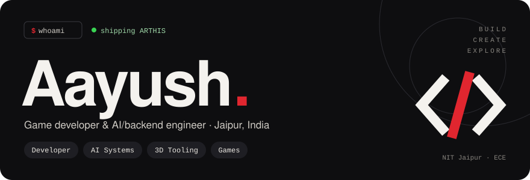

<a href="https://arthis.space">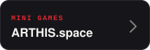</a>
<a href="https://arthis.land">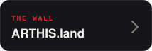</a>
<a href="https://itsAayush2004.github.io">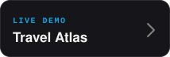</a>
<a href="mailto:aayushkumarofficial21@gmail.com">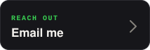</a>

 

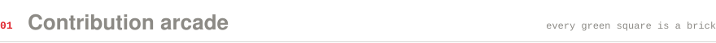

<a href="https://itsaayush2004.github.io/itsAayush2004/breakout/">
<picture>
  <source media="(prefers-color-scheme: dark)" srcset="https://raw.githubusercontent.com/itsAayush2004/itsAayush2004/output/github-snake-dark.svg" />
  <source media="(prefers-color-scheme: light)" srcset="https://raw.githubusercontent.com/itsAayush2004/itsAayush2004/output/github-snake.svg" />
  
</picture>
</a>

My real contribution graph turned into Breakout. Every green square is a brick; darker greens take more hits.

 

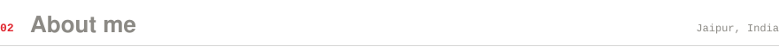

I build **systems that make other things easier to make**: a hex terrain generator so level design
stops being manual, a lip-sync add-on so animation stops being frame-by-frame, an agent layer so a
game can start from a sentence.

I'm a final-year Electronics & Communication student at **NIT Jaipur**, building the ARTHIS universe:
a feed of multiplayer mini-games (**ARTHIS.space**) and a handcrafted Unity vertical city
(**ARTHIS.land — The Wall**), powered by a real-time relay I wrote from scratch in pure-stdlib Python.

> **Right now** 
> &nbsp;→ &nbsp;Building multiplayer mini-games on **ARTHIS.space** 
> &nbsp;→ &nbsp;Crafting **The Wall**, a Unity vertical city 
> &nbsp;→ &nbsp;Shipped **RAG + FastAPI** inference at Clymora · built **GPT-2 from scratch** 
> &nbsp;→ &nbsp;28 custom **Blender add-ons**: lip-sync, camera rigs, IK posing, render automation

 

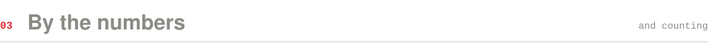

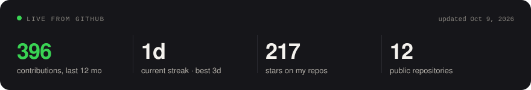

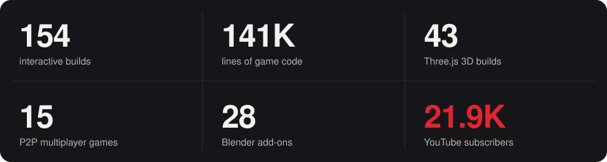

 

<a href="https://itsaayush2004.github.io/portfolio/">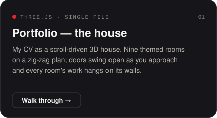</a>
<a href="https://arthis.space">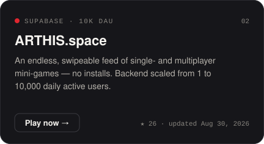</a>
<a href="https://arthis.land">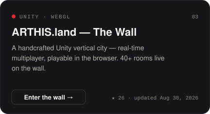</a>
<a href="https://github.com/itsAayush2004/arthisland-relay">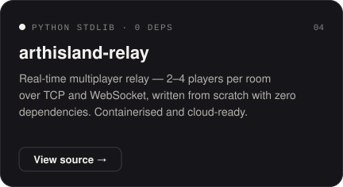</a>
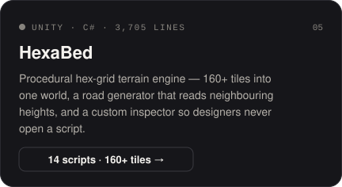
<a href="https://itsAayush2004.github.io">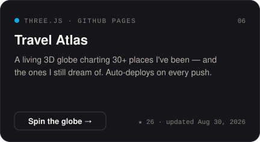</a>

Source:
<a href="https://github.com/itsAayush2004/portfolio">portfolio</a> ·
<a href="https://github.com/itsAayush2004/arthis.space">arthis.space</a> ·
<a href="https://github.com/itsAayush2004/arthis.land">arthis.land</a> ·
<a href="https://github.com/itsAayush2004/arthisland-relay">arthisland-relay</a> ·
<a href="https://github.com/itsAayush2004/TravelAtlas">TravelAtlas</a>

 

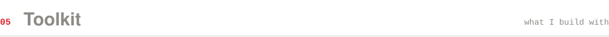

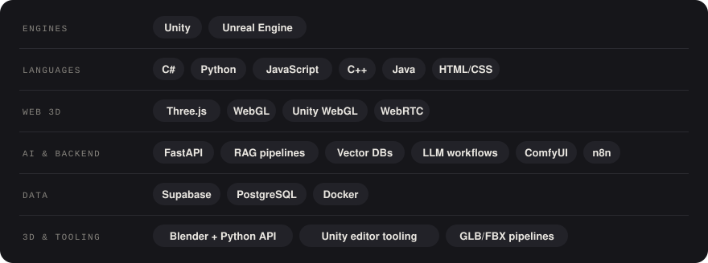

 

<a href="mailto:aayushkumarofficial21@gmail.com">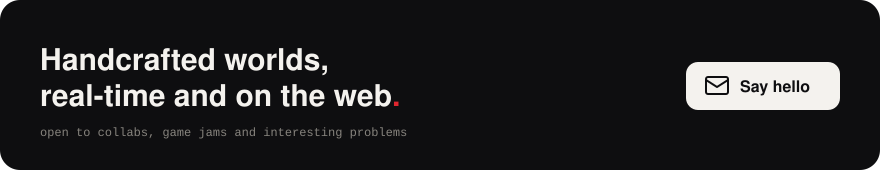</a>
